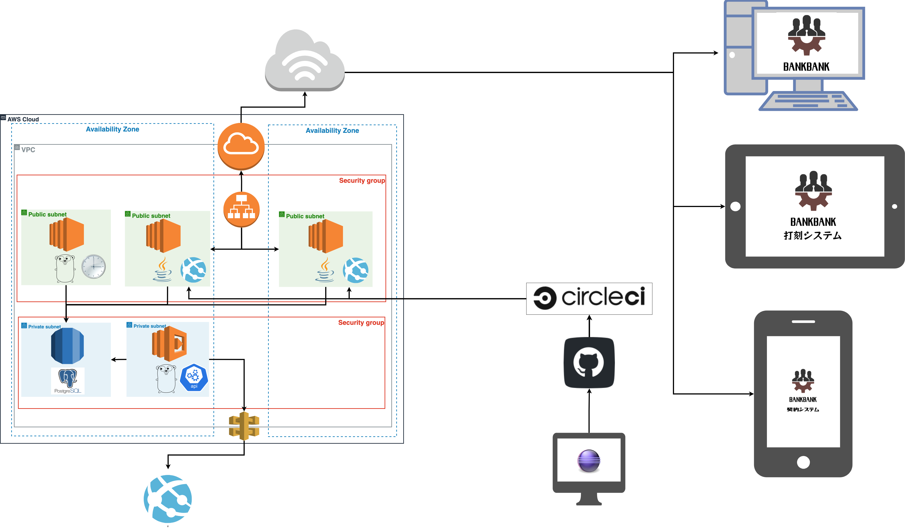

<h2>システム</h2>

<h1>銀行専用人材管理システム</h1>

<h2>インフラ構成図</h2>

<h2>使用技術</h2>

◯Java 11

　・Jasper Report 6.9.0

　・OpenCSV 5.4.0

◯Thymeleaf 3.0.11

◯Spring 2.3.3

　・Spring Security

◯Go 1.15.14

 

◯HTML

◯CSS

◯BootStrap 4.3.1

◯JavaScript

◯jQuery 1.11.1

◯Vue.js

 

◯PostgreSQL 12.4

 

◯AWS

　・VPC

　・EC2

　・RDS

　・ALB

　・Lambda

 

◯GitHub

◯CircleCi CI/CD

◯Maven 3.8.1

◯Eclipse 2021-06

<h2>概要</h2>

銀行を対象にした人材管理システムです。 
銀行業務において発生し得る多様なニーズに即して、 
業務の改善と円滑化を図る事ができます。

<h2>機能</h2>

→同階層の「BANKBANK_機能紹介.pdf」をご覧下さい。

<h2>テーブル定義書</h2>

→同階層の「BANKBANK_テーブル定義書.pdf」をご覧下さい。

<h2>このシステムが発揮出来るバリュー</h2>

◯WHO

銀行で働く職員の方々。
主に人事部の職員。

◯WHERE

主に銀行。
または他のシステムとの連携時。

◯WHEN

人材管理のニーズが生まれた際。

◯HOW

多様な人材課題に対応します。 
・人材情報の一元化、見える化 
・人事業務の効率化 
・意思決定支援 
・人材評価運用の効率化 
・パフォーマンス分析 
・顧客対応の潤滑 

<h2>なぜこのシステムを作ったか</h2>

エンジニアのアウトプットとして何か成果物をと思った際、 
正直今の自分に他の人達に負けない様な新奇性のあるアイディアを生み出せる自信は無く、 
またその熟考する時間をポートフォリ作成の為に投下する事は不必要だと感じたので、 
学習コスト、時間コスト、自身のこれまでのキャリアとの相関性から鑑み、 
このシステムを作るに至りました。 
 
それでも、その中で自分のやりたい事や使いたい技術を少しでも盛り込める様にしたいと思い、 
いくつかそれを実現しました。

<h2>開発において意識した事</h2>

開発工数が掛かりすぎない様にベースとなる言語は、 
前知識があるJavaにしました。 
 
インフラの構成は現場で実際に採用されているを形態を意識し構成しました。 
 
機能要件は実際に利用するユーザーのニーズを想定して選定しました。 
 
このシステムのみで完結するだけでなく、 
APIを利用し外部のシステムと連携出来る様にしました。 
 
人材管理を主としたシステムではありますが、 
人事部の職員の利用のみに特定せず、 
網羅的に他の部署の職員も利用できる様に機能付けを行いました。

<h2>開発において感じた事</h2>

開発が進むに連れて、 
導入したい機能や改善点がどんどんと増えていくので着地点を見つけるのに苦労しました。 
 
日々の業務の中でクライアントの要望が二転三転して仕様変更が乱発する事が散見されますが、 
今回このシステムを作っていく中で正にその現象が起きており、 
クライアントのような自分が開発者の自分の首を絞める状態が慢性的に続きました。 
 
開発に入る前の要件定義の大切さと工数決定の重要性、 
また、予期出来る全てを周到に準備しても、 
結果的にはその全てが何の意味もなさなくなる可能性があるという現実の悲しさを改めて認識しました。 
 
しかし、やはりシステムが形になって現れてくる感動はひとしおで、 
調べながら作業を行っていく中で技術的な問題を解決した時や自身の知見が新たに広がった時は、 
何とも言えない喜びとプログラミングの楽しさを改めて感じました。